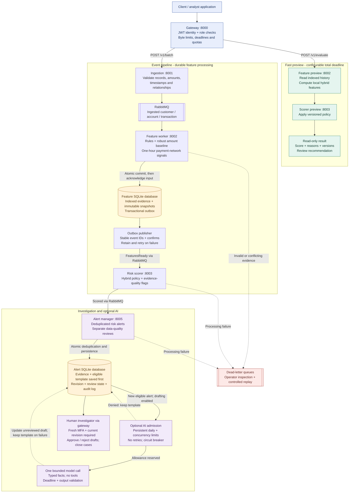

# AML Hybrid Reference Pipeline

An Apache-2.0 reference platform for building explainable anti-money-laundering monitoring. It turns related customer, account, and transaction records into traceable risk indicators, investigator alerts, and optional AI-assisted narrative drafts. Developers can inspect the complete path from validated evidence to a reviewable result.

The September 2026 update addresses practical monitoring problems: rapid movement through intermediary accounts, unusual transaction amounts, expensive history scans, mixed-currency calculations, and unreliable processing after retries or restarts. Its hybrid combines **transparent rules + adaptive amount baselines + temporal payment-network signals**, with local computation on the scoring path and optional generative AI for downstream drafting.

The agent and compute safeguards add durable AI attempt budgets, bounded requests, explicit machine identities, and human review tied to the exact alert revision. A template alert is saved before optional AI work; model failure, excessive demand, or a replay cannot buy another draft for the same transaction. Paid drafting is disabled by default. [Security and cost controls](docs/AI_SECURITY_AND_COST.md) explains the defaults and deployment boundaries.

**Stack:** Python/FastAPI · SQLite native indexes · RabbitMQ · NetworkX · optional OpenAI Responses API. **License:** [Apache-2.0](LICENSE). **Start here:** [Quick start](#quick-start) · [Preview API](#fast-transaction-preview) · [Design and scaling](docs/HYBRID_MONITORING.md) · [AI safeguards](docs/AI_SECURITY_AND_COST.md) · [Contributing](CONTRIBUTING.md).

## How the system works

Two paths share the same feature and scoring policies. **Preview** evaluates a candidate against observed history without storing it. **Batch processing** persists evidence, publishes scored events, and creates alerts for human investigation.



RabbitMQ routes these event types through durable service queues on the shared `aml.events` exchange. The feature database and outbox commit together; ingestion and downstream scoring have separate publication/recovery limitations, described [below](#important-limitations). Preview reads this same feature database without modifying it. It creates no alerts and calls no LLM. A timeout returns an error without a score. Human investigators retain authority over customer actions and regulatory filing.

Machine credentials can assist with authorized ingestion, analysis, notes, and assignment. Draft review and every case-status change, including reopening a case, require a verified human identity with MFA from the last five minutes. Every alert edit supplies `expected_revision`; stale edits return `409` so a later AI response cannot change what an investigator approves.

The separate, opt-in **graph-analysis API :8004** computes NetworkX centrality and communities from a caller-supplied network. It supports exploration outside the scoring path; its data is not automatically synchronized with the feature store.

## What the hybrid adds

| Capability | Practical use | Output or safeguard |
|---|---|---|
| Currency-aware reference rules | Examine near-threshold amounts, velocity, KYC gaps and jurisdiction indicators | Decimal threshold comparisons; unrelated currencies are never added together |
| Adaptive amount baseline | Spot unusually large payments relative to the account's observed behavior | Robust median/MAD score with explicit minimum-history warm-up |
| Temporal network signals | Surface rapid collection and forwarding, spreading payments, and reciprocal flows | Bounded one-hour motifs using explicit canonical outbound transfers |
| Durable feature processing | Keep decisions stable across replay, outages and service restarts | Immutable snapshots, conflicting-ID rejection and a transactional feature outbox |
| Fast assessment preview | Obtain a score before submitting a candidate to the event pipeline | Authenticated read-only API; deadline failure returns no score |
| Human review and optional AI | Give investigators grounded evidence and draft narrative assistance | Data gaps remain explicit; drafts require review; no automated filing |
| AI cost and outage controls | Contain runaway callers, repeated deliveries, and provider failures | Opt-in drafting; 100 attempted calls per UTC day, 2 active reservations, no SDK retries; stored template remains usable |
| Agent identity and request limits | Restrict automated authority and bound request work | 15-minute agent token lifetime; human MFA for final actions; per-subject quotas and streamed-byte caps |

**Measured local performance:** on 100,000 synthetic transactions, indexed feature-preview p95 was **1.68 ms**, compared with **11.65 ms** for the global-scan reference using the same feature policy. These warm computation timings exclude HTTP, durable ingestion, RabbitMQ and narratives. [Raw results](docs/benchmarks/windows-100k.json) · [Reproduce the benchmark](docs/HYBRID_MONITORING.md#benchmarking).

**Scope:** this is a testable engineering reference with a single authoritative SQLite feature worker. It is not a validated production AML system, sanctions-screening service, or filing tool. Detection weights, model/policy validation, authoritative screening data, distributed deployment, and investigation decisions require institution-specific work. Read the [model card](MODEL_CARD.md) and [deployment boundaries](docs/HYBRID_MONITORING.md#scaling-and-operations).

## What is implemented

- Strict Pydantic validation, timezone-aware timestamps, decimal monetary input, duplicate detection, referential-integrity checks, record limits, and bounded uploads.
- Signed JWT validation with expiry, issuer, audience, algorithm allow-listing, and role checks. Authentication can only be bypassed with the explicit `AUTH_DISABLED=true` development setting.
- Currency-aware threshold features. Threshold logic is disabled when the base-currency amount is unavailable instead of comparing unrelated currencies.
- Currency-isolated historical monetary totals and decimal threshold comparisons.
- Robust log-amount median/MAD baselines, explicit warm-up state, temporal fan-in/fan-out, rapid pass-through, and reciprocal-transfer signals.
- Bounded indexed event-time windows, immutable feature snapshots, conflicting-replay rejection, durable feature outbox, and explicit incomplete-evidence review routing.
- A versioned FATF jurisdiction snapshot. FATF monitored-jurisdiction flags are risk inputs only; they are not sanctions matches or automatic customer decisions.
- Deterministic reference-policy scoring. The repository publishes no accuracy, precision, recall, AUC, confidence, or SHAP claims because it includes no trained artifact and no representative labeled validation set.
- Persistent, transaction-deduplicated alerts in SQLite with append-only audit events for alert creation, investigation changes, assignment, and narrative review.
- Optional OpenAI Responses API drafting with typed, size-limited evidence, `store=false`, no tools, an eight-second deadline, durable attempt limits, and a circuit breaker. Templates are committed before model calls; late output cannot overwrite a reviewed narrative.
- Revision checks on every alert edit, human MFA for final reviews, and narrative hashes in review audit events. Alert pagination and aggregation execute in SQLite without decoding the entire alert history in Python.
- A deterministic NetworkX graph analyzer with real centrality/community calculations rather than random simulated outputs.
- Non-root, read-only application containers, dropped Linux capabilities, loopback-bound development ports, health-gated startup, persistent alert data, and Compose-mounted broker/JWT secrets.

## Quick start

Prerequisites: Docker with Compose and Python 3.12 for local development.

1. Copy the configuration template and generate untracked local secret files:

   ```bash
   cp example.env.txt .env
   python scripts/create_local_secrets.py
   ```

2. Validate and start the stack:

   ```bash
   docker compose config --quiet
   docker compose up --build --wait
   ```

3. Create a short-lived local token using the generated JWT secret:

   ```bash
   export JWT_SECRET_KEY="$(cat secrets/jwt_secret)"
   export JWT_ISSUER='aml-reference'
   export JWT_AUDIENCE='aml-api'
   python scripts/create_dev_token.py
   ```

4. Use the returned token with the gateway:

   ```bash
   curl -H "Authorization: Bearer $TOKEN" http://127.0.0.1:8000/v1/alerts
   ```

Swagger UI is available at `http://127.0.0.1:8000/docs`. Internal service ports are published only on loopback for local inspection; expose only the gateway in a deployed environment.

### Optional OpenAI drafting

The default `SAR_GENERATION_ENABLED=false` uses deterministic templates. Optional AI drafting requires both `SAR_GENERATION_ENABLED=true` and a configured `OPENAI_API_KEY`. The alert manager uses the pinned model snapshot in `OPENAI_MODEL`. Generated content is always marked `DRAFT - HUMAN REVIEW REQUIRED`; no code path files or submits a SAR/STR.

The default allowance is 100 attempted calls per UTC day, at most two active reservations, 8 KiB of input including instructions, 700 output tokens, and an eight-second deadline. Failed or uncertain attempts remain charged; SDK retries are disabled. `AI_DAILY_CALL_LIMIT=0` prevents new paid attempts. These are application attempt bounds, not a provider billing guarantee. See [settings, recovery, and identity migration](docs/AI_SECURITY_AND_COST.md).

Do not send production customer data to an external model until your organization has approved the data classification, retention, residency, contractual, access-control, and incident-response requirements. The implementation omits customer, account, and transaction identifiers from model input by default.

## Development

```bash
python -m venv .venv
.venv/bin/python -m pip install -r requirements-dev.txt
.venv/bin/python -m pytest
.venv/bin/ruff check services tests
.venv/bin/ruff format --check services tests
```

On Windows, use `.venv\Scripts\python.exe` and `.venv\Scripts\ruff.exe`.

The automated suite covers validation, relationship integrity, currency handling, temporal leakage, deterministic scoring, honest scorer metadata, narrative grounding, alert audit/review, graph determinism, and JWT enforcement.

It also covers restart recovery, concurrent replay, transactional rollback, retry identity, bounded histories, network patterns, anomaly warm-up, gateway deadlines, preview isolation, and feature-to-alert integration. Adversarial tests cover AI budgets, cancellation, malformed model output, prompt-bearing evidence, oversized streamed bodies, quota exhaustion, malformed JWT claims, machine review attempts, and stale revisions. All model responses are mocked. CI runs Python 3.12/3.13 on Linux and Windows, checks generated API contracts, validates Compose configuration, and runs an isolated RabbitMQ smoke test. See [container test commands](CONTRIBUTING.md).

### Fast transaction preview

First ingest historical customer/account/transaction evidence through `/v1/batch`. Then evaluate a candidate using an `ingestor`, `analyst`, `compliance_officer`, or `admin` token:

```bash
curl -X POST http://127.0.0.1:8000/v1/evaluate \
  -H "Authorization: Bearer $TOKEN" -H 'Content-Type: application/json' \
  -d '{"transaction":{"txn_id":"preview-1","account_id":"A1","timestamp":"2026-09-07T12:00:00Z","amount":"2900","currency":"USD","counterparty_country":"US","direction":"outbound","counterparty_account_id":"B1"}}'
```

Use strings for transaction values, including exact decimal amounts. The result includes `mode: "preview"`, features, feature/scorer versions, the feature computation time, triggered rules, and `review_recommended`. Previewing does not learn a transaction, create an alert, or make a payment decision. A previously ingested ID returns its original feature snapshot; changed evidence under that ID returns `409`. The total gateway deadline defaults to one second; a timeout returns `504` with no score. Persist actual transactions through batch ingestion.

Network signals require stable account identifiers in one shared namespace and explicit `direction: "outbound"`. Send one canonical outbound record per payment; inbound ledger mirrors do not create graph edges. Older records remain valid, with network evidence marked unavailable. See [semantics, scaling, and migration](docs/HYBRID_MONITORING.md).

## API summary

| Service | Main endpoints |
|---|---|
| Gateway | `POST /v1/evaluate`, `POST /v1/batch`, `GET /v1/alerts`, `GET /v1/alerts/statistics`, `GET /v1/transactions/{txn_id}` |
| Ingestion | `POST /batch`, `/health/live`, `/health/ready` |
| Feature engine | `POST /compute`, `GET /features/{txn_id}`, `GET /metadata` |
| Risk scorer | `POST /evaluate`, `POST /score`, `GET /scores/{txn_id}`, `GET /scorer/metadata` |
| Alert manager | `GET/PATCH /alerts/{id}`, `GET /alerts/{id}/audit`, `GET /alerts/statistics` |
| Graph analysis | `POST /graph/transactions`, `GET /graph/risk/{party_id}`, `GET /metadata` |

## Important limitations

- Feature history, minimal customer/account context, feature snapshots, and the feature outbox are persistent. Score and standalone graph caches remain in process memory; alert evidence and audit events are persistent.
- The feature service is one process with one serialized SQLite connection. Do not add competing consumers with independent local databases: that splits the evidence. Bounded query work improves local scaling; distributed account and network materialization requires a different storage/routing deployment. See the scaling guide.
- Late data never rewrites prior decisions. Same-timestamp transactions are excluded from each other's history; late-event and history-cap flags request review. Historical customer/account context is the version observed when the feature snapshot was made, not a bitemporal KYC archive.
- Disk retention is operator-managed. No automatic evidence deletion is enabled; set storage alerts, tested backups, and an approved retention policy.
- SQLite is appropriate for the reference stack, not a horizontally scaled case-management system.
- Batch event publication does not implement a transactional outbox; a broker failure partway through a batch can produce a partial batch. The new outbox covers the feature stage only. Production ingestion and downstream scoring still need equivalent durable handoff controls; dead letters require operational monitoring and replay.
- Country codes do not identify sanctioned persons or prohibited transactions. Integrate an authoritative, current entity-screening system and pass a reviewed `sanctions_match` signal separately.
- The FATF snapshot must be refreshed and independently approved after each relevant publication. Increased monitoring does not itself call for enhanced due diligence or de-risking.
- Risk weights and thresholds are illustrative. Validate conceptual soundness, data suitability, outcomes, calibration, drift, bias, overrides, and operating controls before use.
- Narrative approval records human review of a draft; it does not constitute a regulatory filing decision or submission.
- AI budgets require the persistent authoritative alert database; separate databases multiply the allowance. Gateway quotas are per process. Trusted identity claims do not detect an agent borrowing a human's credentials. See [remaining security boundaries](docs/AI_SECURITY_AND_COST.md#deployment-boundaries).
- TLS termination, distributed rate limiting, centralized authorization, immutable enterprise audit storage, observability, backups, disaster recovery, data retention, and key rotation belong in the deployment platform.

## Guidance used for this upgrade

- [FATF Recommendations and risk-based approach](https://www.fatf-gafi.org/en/publications/Fatfrecommendations/Fatf-recommendations.html)
- [FATF high-risk and monitored jurisdictions](https://www.fatf-gafi.org/en/countries/black-and-grey-lists.html)
- [OFAC Sanctions List Service](https://ofac.treasury.gov/sanctions-list-service)
- [FinCEN SAR narrative guidance](https://www.fincen.gov/resources/statutes-regulations/guidance/sar-narrative-guidance-package)
- [Federal Reserve revised model-risk guidance (SR 26-2)](https://www.federalreserve.gov/supervisionreg/srletters/SR2602.htm)
- [NIST AI Risk Management Framework](https://www.nist.gov/itl/ai-risk-management-framework)
- [OWASP API Security Top 10](https://owasp.org/API-Security/)
- [RabbitMQ reliability guidance](https://www.rabbitmq.com/docs/reliability)
- [Docker Compose startup-order guidance](https://docs.docker.com/compose/how-tos/startup-order/)
- [OpenAI Responses API reference](https://developers.openai.com/api/reference/cli/resources/responses/methods/create)

See [MODEL_CARD.md](MODEL_CARD.md) and [SECURITY.md](SECURITY.md) before extending or deploying the system.

## Contributing and license

Licensed under [Apache-2.0](LICENSE), including its express patent grant and conditions. See [CONTRIBUTING.md](CONTRIBUTING.md) for setup, tests, policy changes, and API contract generation, and [the September 2026 engineering rationale](docs/HYBRID_MONITORING.md) for the sources and design boundaries behind this update.
